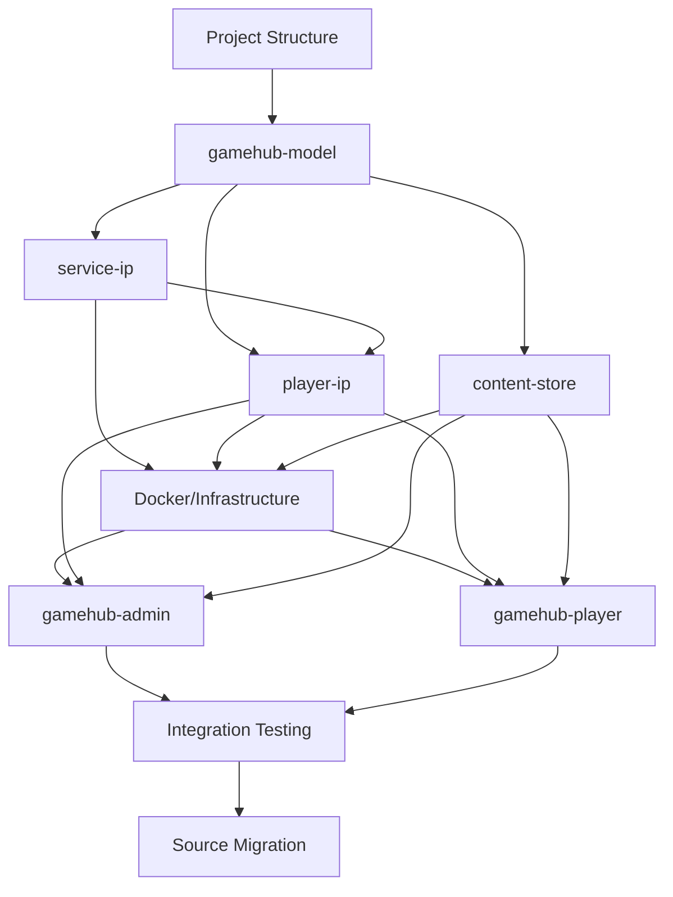

# Ideal Order of Operations for GameHub Migration

Based on my analysis of the GameHub architecture and dependencies, here's the optimal migration sequence that minimizes risk and ensures each component has its dependencies ready:

## ✅ Completed Infrastructure

### Project Foundation
- [x] **Comprehensive .gitignore** - Created with proper exclusions for Node.js, TypeScript, IDEs, OS files, and project-specific patterns
- [x] **Project structure** - Base directory structure is established and ready for development

### Phase 1.3 - Shared Data Model (COMPLETE)
- [x] **gamehub-model package** - Complete npm package with dual build system (ESM + CJS)
- [x] **Domain transformation** - Successfully transformed LaunchKings domain model to GameHub
- [x] **Core Jinaga facts** - User, Tenant, GameSession, Player, and all supporting facts
- [x] **Authorization system** - Comprehensive rules for tenant and game session access control
- [x] **Distribution system** - Proper data distribution rules for multi-tenant architecture
- [x] **TypeScript configuration** - Multiple build targets with proper type generation

### Phase 1.2 - Environment Configuration (PARTIAL)
- [x] **Secrets directory structure** - [`mesh/secrets/shared/`](mesh/secrets/shared/) established
- [x] **Service communication foundation** - Initial setup for shared secrets (in progress)

## Phase 1: Foundation and Dependencies (Days 1-3)
**Critical Path**: These components have no dependencies and are required by everything else

### 1.1 Project Structure Setup
```bash
# Create the complete directory structure first
mkdir -p {app,mesh,scripts,data,http,notebooks,screenshots}
mkdir -p app/{gamehub-model,gamehub-admin,gamehub-player,service-ip,player-ip,content-store,load-test}
mkdir -p mesh/{nginx,front-end,secrets}
mkdir -p scripts/{setup,deployment}
```

### 1.2 Environment Configuration
- [x] Set up [`mesh/secrets/`](mesh/secrets/) directory structure
- [x] Generate shared secrets for service-to-service communication (started)
- [x] Create base environment files (started)

### 1.3 Shared Data Model ([`app/gamehub-model/`](app/gamehub-model/))
**Priority: HIGHEST** - Everything depends on this
- [x] Create the npm package structure with dual build (ESM + CJS)
- [x] Define core Jinaga facts (User, Tenant, GameSession, Player)
- [x] Implement authorization rules
- [x] Implement distribution rules
- [x] Set up policy generation scripts

**Why First**: All services and applications depend on this shared model. Without it, nothing else can be properly typed or function.

## Phase 2: Core Backend Services (Days 4-7)
**Critical Path**: Authentication services must come before applications

### 2.1 Service IP ([`app/service-ip/`](app/service-ip/)) - Port 8083 ✅ COMPLETE
**Priority: HIGH** - Required for service-to-service auth
- [x] Implement Client Credentials Flow
- [x] Set up file-based client management
- [x] Create JWT token issuance
- [x] Configure shared secret validation
- [x] Docker configuration and deployment scripts
- [x] Environment configuration and secrets management
- [x] Integration with mesh infrastructure

**Why Second**: Other services need this for authentication, and it has minimal dependencies.

### 2.2 Player IP ([`app/player-ip/`](app/player-ip/)) - Port 8082 ✅ COMPLETE
**Priority: HIGH** - Required for user authentication
- [x] Implement OAuth 2.0 + PKCE Flow
- [x] Set up SQLite database
- [x] Create JWT with refresh token rotation
- [x] Integrate with Service IP for backend communication
- [x] Add QR code authentication support
- [x] Docker configuration and deployment scripts
- [x] Environment configuration and secrets management
- [x] Integration with mesh infrastructure
- [x] Complete OAuth 2.0 identity provider implementation

**Why Third**: Frontend applications need this for user authentication, but it depends on Service IP.

### 2.3 Content Store ([`app/content-store/`](app/content-store/)) - Port 8081
**Priority: MEDIUM** - Can be developed in parallel with frontend
- [ ] Implement content-addressable storage (SHA-256)
- [ ] Set up multipart file upload handling
- [ ] Configure authentication integration with Player IP
- [ ] Set up Docker volume mounting

**Why Fourth**: Less critical for initial functionality, can be developed alongside frontend.

## Phase 3: Infrastructure Setup (Days 6-8)
**Can overlap with Phase 2**

### 3.1 Docker Orchestration ([`mesh/`](mesh/))
- [ ] Configure Nginx reverse proxy
- [ ] Set up Docker Compose with all services
- [ ] Configure service networking and volumes
- [ ] Set up PostgreSQL for FusionAuth
- [ ] Configure FusionAuth container

### 3.2 Policy Generation Pipeline
- [ ] Set up automated Jinaga policy generation
- [ ] Configure policy deployment to replicator
- [ ] Test policy updates and service restarts

## Phase 4: Frontend Applications (Days 8-12)
**Depends on backend services being functional**

### 4.1 Admin Portal ([`app/gamehub-admin/`](app/gamehub-admin/))
**Priority: HIGH** - Needed for system administration
- [ ] Set up React + Vite + TypeScript + TailwindCSS
- [ ] Implement atomic design component structure
- [ ] Integrate Jinaga client with real-time data
- [ ] Implement OAuth 2.0 authentication flow
- [ ] Build core admin features:
  - [ ] Tenant management
  - [ ] User administration
  - [ ] Session management
  - [ ] Service principal management

### 4.2 Player Portal ([`app/gamehub-player/`](app/gamehub-player/))
**Priority: MEDIUM** - Can be developed in parallel with admin
- [ ] Set up React + Vite + TypeScript + TailwindCSS
- [ ] Implement atomic design component structure
- [ ] Integrate Jinaga client with real-time data
- [ ] Implement OAuth 2.0 PKCE authentication flow
- [ ] Build core player features:
  - [ ] Session participation
  - [ ] Player registration
  - [ ] Real-time gameplay interface

## Phase 5: Integration and Testing (Days 12-15)
**Critical for production readiness**

### 5.1 End-to-End Integration
- [ ] Test complete authentication flows
- [ ] Verify real-time data synchronization
- [ ] Test service-to-service communication
- [ ] Validate Docker orchestration

### 5.2 Setup Automation ([`scripts/setup/`](scripts/setup/))
- [ ] Create automated setup scripts
- [ ] Implement FusionAuth configuration automation
- [ ] Create database initialization scripts
- [ ] Set up development environment automation

## Phase 6: Migration from Existing Application (Days 15-20)
**After core system is functional**

### 6.1 Source Analysis
- [ ] Map existing components to GameHub equivalents
- [ ] Identify reusable business logic
- [ ] Plan data migration strategy
- [ ] Create component renaming strategy

### 6.2 Systematic Migration
- [ ] Migrate business logic to Jinaga facts
- [ ] Port existing React components with new naming
- [ ] Adapt authentication flows
- [ ] Migrate configuration and environment settings

### 6.3 Data Migration
- [ ] Create migration scripts for existing data
- [ ] Test data integrity after migration
- [ ] Validate business rule preservation

## Critical Dependencies Map



## Risk Mitigation Strategy

### High-Risk Dependencies
1. **Jinaga Model**: If this fails, everything fails
   - [ ] **Mitigation**: Start with minimal viable model, iterate
   - [ ] **Validation**: Create comprehensive tests early

2. **Authentication Flow**: Complex OAuth 2.0 + PKCE implementation
   - [ ] **Mitigation**: Implement and test auth services before frontend
   - [ ] **Validation**: Create isolated auth flow tests

3. **Service Communication**: Multiple services must communicate securely
   - [ ] **Mitigation**: Implement service-ip first, test with simple clients
   - [ ] **Validation**: Create service-to-service integration tests

### Parallel Development Opportunities
- **Content Store** can be developed alongside **Player IP**
- **Admin Portal** and **Player Portal** can be developed in parallel
- **Docker Infrastructure** can be set up while backend services are being developed
- **Setup Scripts** can be created while testing integration

## Success Milestones

- [x] **Day 3**: Jinaga model compiles and generates policies
- [x] **Day 5**: Service IP issues valid JWT tokens ✅ COMPLETE
- [x] **Day 7**: Player IP completes OAuth flow with Service IP ✅ COMPLETE
- [ ] **Day 9**: Docker Compose starts all services successfully
- [ ] **Day 11**: Admin portal authenticates and displays real-time data
- [ ] **Day 13**: Player portal participates in game sessions
- [ ] **Day 15**: End-to-end system test passes
- [ ] **Day 20**: Migration from existing application complete

This order ensures that each component has its dependencies ready when needed, minimizes rework, and provides clear validation points throughout the migration process.