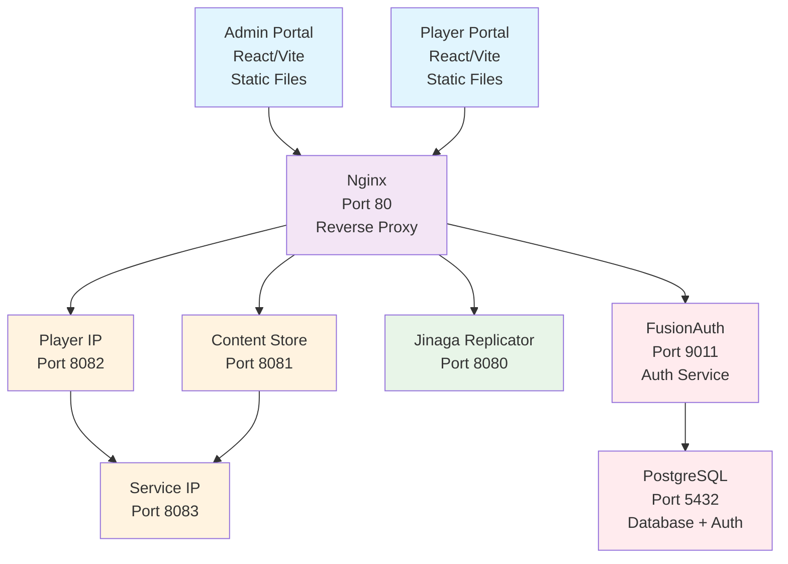

# Architecture Overview

This guide provides a high-level overview of the GameHub platform architecture, including system components, data flow, and service interactions.

## Table of Contents

- [Architecture Overview](#architecture-overview)
  - [Table of Contents](#table-of-contents)
  - [System Architecture](#system-architecture)
    - [High-Level Overview](#high-level-overview)
    - [Architecture Diagram](#architecture-diagram)
  - [Core Components](#core-components)
    - [Frontend Applications](#frontend-applications)
      - [Admin Portal (`gamehub-admin`)](#admin-portal-gamehub-admin)
      - [Player Portal (`gamehub-player`)](#player-portal-gamehub-player)
    - [Backend Services](#backend-services)
      - [Service IP (Port 8083)](#service-ip-port-8083)
      - [Player IP (Port 8082)](#player-ip-port-8082)
      - [Content Store (Port 8081)](#content-store-port-8081)
      - [Jinaga Replicator (Port 8080)](#jinaga-replicator-port-8080)
  - [Data Architecture](#data-architecture)
    - [Jinaga Model](#jinaga-model)
    - [Data Flow](#data-flow)
    - [Storage Layers](#storage-layers)
  - [Next Steps](#next-steps)

## System Architecture

### High-Level Overview
GameHub follows a microservices architecture pattern with the following key characteristics:
- **Frontend**: Multiple React applications for different user roles
- **Data Layer**: Jinaga for distributed data management
- **Backend Services**: Game logic and content
- **Orchestration**: Docker Compose for local development
- **Authentication**: OAuth 2.0 identity providers (IP) for different audiences

### Architecture Diagram

## Core Components

### Frontend Applications

#### Admin Portal (`gamehub-admin`)
- **Purpose**: Administrative interface for environment management
- **Technology**: React 18 + TypeScript + Vite
- **Features**: Tenant creation, service management, configuration
- **Authentication**: OAuth 2.0 via FusionAuth

#### Player Portal (`gamehub-player`)
- **Purpose**: Player interface for game session initiation and participation
- **Technology**: React 18 + TypeScript + Vite
- **Features**: Session registration, gameplay interactions, real-time updates
- **Authentication**: OAuth 2.0 via player IP

### Backend Services

#### Service IP (Port 8083)
- **Purpose**: OAuth 2.0 Client Credentials identity provider for backend services
- **Technology**: Node.js + Express + TypeScript
- **Responsibilities**: OAuth 2.0 Client Credentials Flow, JWT token issuance and validation
- **Client Management**: File-based client credential management in `/mesh/secrets/service-ip/clients`
- **Authentication Flow**: Client Credentials grant type for service-to-service authentication
- **Integration**: Fully integrated with mesh infrastructure and Docker orchestration

#### Player IP (Port 8082)
- **Purpose**: OAuth 2.0 identity provider for player authentication
- **Technology**: Node.js + Express + TypeScript
- **Responsibilities**: OAuth 2.0 Authorization Code Flow with PKCE, JWT token issuance with refresh token rotation
- **Data Access**: SQLite database for user and session management
- **Authentication Flow**: Authorization Code + PKCE for frontend applications
- **Integration**: Service IP for backend authentication, cookie-based session management
- **Security Features**: QR code authentication, secure token storage, CORS protection

#### Content Store (Port 8081)
- **Purpose**: File and media management service
- **Technology**: Node.js with file system integration
- **Responsibilities**: Image uploads, document storage, asset serving
- **Storage**: Docker volume mounting with persistent storage
- **Authentication**: Provider-based authentication integration

#### Jinaga Replicator (Port 8080)
- **Purpose**: Distributed data synchronization and event sourcing
- **Technology**: Jinaga replicator service (Docker image)
- **Version**: jinaga/jinaga-replicator:3.5.2
- **Responsibilities**: Fact distribution, authorization policies, subscriptions
- **Storage**: PostgreSQL backend with volume persistence

## Data Architecture

### Jinaga Model
- **Pattern**: Historical modeling with immutable facts
- **Distribution**: Automatic data synchronization across services
- **Authorization**: Rule-based access control
- **Benefits**: Audit trail, real-time updates, conflict resolution

### Data Flow
1. **Player Actions**: Frontend applications capture player interactions
2. **Fact Creation**: Business logic creates immutable facts
3. **Distribution**: Jinaga distributes facts to relevant subscribers
4. **UI Updates**: Frontend applications receive real-time updates

### Storage Layers
- **Jinaga Replicator**: Primary data storage for Jinaga facts
- **SQLite**: Operational storage for identity providers
- **IndexedDB**: Local storage of Jinaga facts for browser-based applications
- **File System**: Static assets and uploaded content
- **PostgreSQL**: Storage for FusionAuth configuration and accounts

## Next Steps

Now that you understand the system architecture, proceed to [Project Setup](./03-project-setup.md) to begin configuring your development environment.

---

*Need more details about specific components? Each component is covered in detail in the subsequent setup guides.*