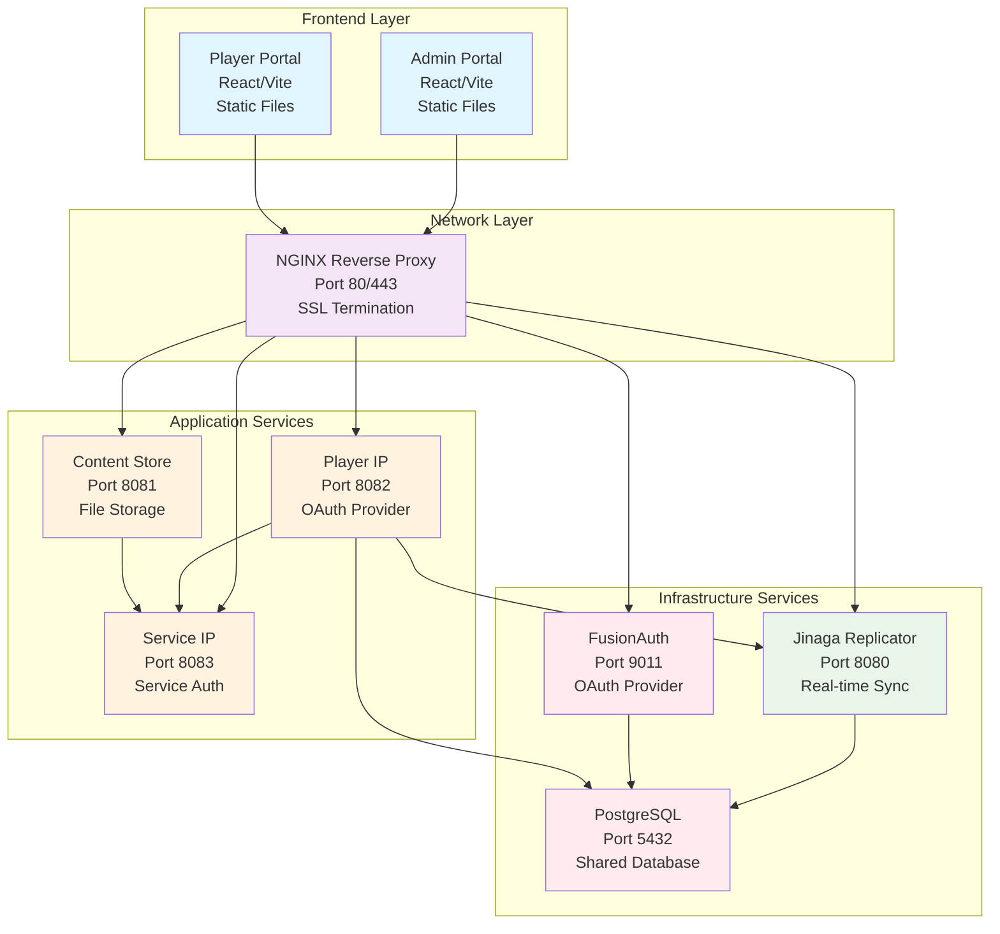
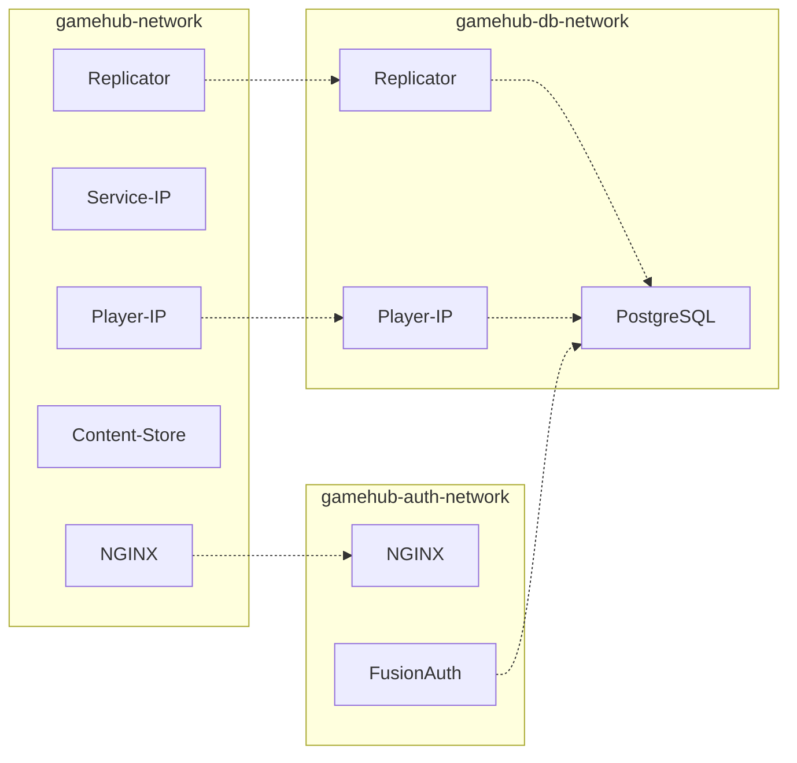

# Architecture Overview

This guide provides a high-level overview of the GameHub platform architecture, including system components, data flow, and service interactions for the infrastructure.

## Table of Contents

- [Architecture Overview](#architecture-overview)
  - [Table of Contents](#table-of-contents)
  - [System Architecture](#system-architecture)
    - [High-Level Overview](#high-level-overview)
    - [Architecture Diagram](#architecture-diagram)
    - [Network Architecture](#network-architecture)
  - [Core Components](#core-components)
    - [Infrastructure Services](#infrastructure-services)
      - [PostgreSQL Database](#postgresql-database)
      - [FusionAuth Authentication](#fusionauth-authentication)
      - [Jinaga Replicator](#jinaga-replicator)
      - [NGINX Reverse Proxy](#nginx-reverse-proxy)
    - [Backend Services](#backend-services)
      - [Service IP (Port 8083)](#service-ip-port-8083)
      - [Player IP (Port 8082)](#player-ip-port-8082)
      - [Content Store (Port 8081)](#content-store-port-8081)
    - [Frontend Applications](#frontend-applications)
      - [Admin Portal (`gamehub-admin`)](#admin-portal-gamehub-admin)
      - [Player Portal (`gamehub-player`)](#player-portal-gamehub-player)
  - [Data Architecture](#data-architecture)
    - [Jinaga Model](#jinaga-model)
    - [Data Flow](#data-flow)
    - [Storage Layers](#storage-layers)
  - [Security Architecture](#security-architecture)
    - [Network Segmentation](#network-segmentation)
    - [Authentication Flow](#authentication-flow)
    - [Authorization Policies](#authorization-policies)
  - [Next Steps](#next-steps)

## System Architecture

### High-Level Overview
GameHub follows a microservices architecture pattern with the infrastructure providing:
- **Infrastructure Layer**: PostgreSQL, FusionAuth, Jinaga replicator
- **Network Layer**: NGINX reverse proxy with SSL termination
- **Application Layer**: Backend services for authentication and content
- **Frontend Layer**: React applications for different user roles
- **Security Layer**: Network segmentation and OAuth 2.0 authentication
- **Orchestration**: Docker Compose with health checks and dependencies

### Architecture Diagram

### Network Architecture

The infrastructure uses three isolated Docker networks for security:

## Core Components

### Infrastructure Services

#### PostgreSQL Database
- **Purpose**: Shared database for FusionAuth and Jinaga replicator
- **Technology**: PostgreSQL 16.0
- **Features**: ACID compliance, JSON support, full-text search
- **Integration**: Shared by FusionAuth and Jinaga replicator
- **Persistence**: Docker volume with automatic backups
- **Health Checks**: Built-in pg_isready monitoring

#### FusionAuth Authentication
- **Purpose**: OAuth 2.0 provider for web applications
- **Technology**: FusionAuth latest version
- **Features**: Complete identity management, OAuth 2.0/OIDC, user registration
- **Database**: PostgreSQL backend
- **Admin Interface**: Available at `/auth/` through NGINX
- **Integration**: Provides authentication for admin and player portals

#### Jinaga Replicator
- **Purpose**: Distributed data synchronization and event sourcing
- **Technology**: Jinaga replicator service v3.5.2
- **Features**: Real-time fact distribution, authorization policies, subscriptions
- **Storage**: Built-in storage for facts
- **Configuration**: GameHub-specific policies and authentication providers
- **Health Checks**: HTTP health endpoint monitoring

#### NGINX Reverse Proxy
- **Purpose**: SSL termination, load balancing, and service routing
- **Technology**: NGINX stable-alpine
- **Features**: SSL/TLS support, compression, caching, security headers
- **Routing**: Path-based routing to all services
- **Static Content**: Serves built React applications
- **Health Checks**: Built-in health endpoint

### Backend Services

#### Service IP (Port 8083)
- **Purpose**: OAuth 2.0 Client Credentials identity provider for backend services
- **Technology**: Node.js + Express + TypeScript
- **Responsibilities**: OAuth 2.0 Client Credentials Flow, JWT token issuance and validation
- **Client Management**: File-based client credential management in `/mesh/secrets/service-ip/clients`
- **Authentication Flow**: Client Credentials grant type for service-to-service authentication
- **Integration**: Fully integrated with mesh infrastructure and Docker orchestration
- **Health Checks**: HTTP health endpoint with dependency validation

#### Player IP (Port 8082)
- **Purpose**: OAuth 2.0 identity provider for player authentication
- **Technology**: Node.js + Express + TypeScript
- **Responsibilities**: OAuth 2.0 Authorization Code Flow with PKCE, JWT token issuance with refresh token rotation
- **Database**: SQLite database for user and session management
- **Authentication Flow**: Authorization Code + PKCE for frontend applications
- **Integration**: Service IP for backend authentication, Jinaga replicator for data sync
- **Security Features**: QR code authentication, secure token storage, CORS protection
- **Health Checks**: Database connectivity and service dependency validation

#### Content Store (Port 8081)
- **Purpose**: Content-addressable storage service for files and media
- **Technology**: Node.js with Express and file system integration
- **Storage Model**: SHA-256 hash-based content addressing for deduplication
- **Authentication**: JWT-based authentication supporting both service-ip and player-ip tokens
- **Authorization**: Provider-based authentication using same format as Jinaga replicator
- **Upload Features**: Multipart file upload with 50MB size limit and idempotent operations
- **Retrieval**: Public content access via content hash with proper MIME type handling
- **Integration**: Fully integrated with mesh infrastructure and Docker orchestration
- **Persistence**: Docker volume for file storage

### Frontend Applications

#### Admin Portal (`gamehub-admin`)
- **Purpose**: Administrative interface for environment management
- **Technology**: React 18 + TypeScript + Vite
- **Features**: Tenant creation, service management, configuration
- **Authentication**: OAuth 2.0 via FusionAuth
- **Deployment**: Static files served by NGINX at `/admin/`
- **Real-time**: Jinaga integration for live updates

#### Player Portal (`gamehub-player`)
- **Purpose**: Player interface for game session initiation and participation
- **Technology**: React 18 + TypeScript + Vite
- **Features**: Session registration, gameplay interactions, real-time updates
- **Authentication**: OAuth 2.0 via Player IP
- **Deployment**: Static files served by NGINX
- **Real-time**: Jinaga integration for live gameplay updates

## Data Architecture

### Jinaga Model
- **Pattern**: Historical modeling with immutable facts
- **Distribution**: Automatic data synchronization across services
- **Authorization**: Rule-based access control with GameHub-specific policies
- **Benefits**: Audit trail, real-time updates, conflict resolution
- **Storage**: Built-in storage for facts

### Data Flow
1. **Player Actions**: Frontend applications capture player interactions
2. **Fact Creation**: Business logic creates immutable facts
3. **Authorization**: Jinaga policies validate fact access
4. **Distribution**: Jinaga distributes facts to relevant subscribers
5. **UI Updates**: Frontend applications receive real-time updates
6. **Persistence**: Facts stored in PostgreSQL with full history

### Storage Layers
- **PostgreSQL**: Storage for FusionAuth data
- **Docker Volumes**: Persistent storage for database data, content files, and configurations
- **IndexedDB**: Local storage of Jinaga facts for browser-based applications
- **File System**: Static assets and uploaded content in content-store
- **Memory**: Runtime caching and session storage

## Security Architecture

### Network Segmentation
- **gamehub-network**: Core application services communication
- **gamehub-db-network**: Database access isolation
- **gamehub-auth-network**: Authentication service isolation

### Authentication Flow
1. **Web Applications**: OAuth 2.0 Authorization Code + PKCE via FusionAuth
2. **Service-to-Service**: OAuth 2.0 Client Credentials via Service IP
3. **Player Authentication**: OAuth 2.0 Authorization Code + PKCE via Player IP
4. **Content Access**: JWT-based authentication with provider validation

### Authorization Policies
- **Jinaga Policies**: Fact-level authorization rules
- **Service Policies**: API endpoint protection
- **Network Policies**: Container-level network isolation
- **File Policies**: Content-store access control

## Next Steps

Now that you understand the current system architecture, proceed to [Project Setup](./03-project-setup.md) to begin configuring your development environment.

**Key current Features:**
- PostgreSQL database for FusionAuth
- FusionAuth OAuth provider
- Network segmentation
- Comprehensive health monitoring
- SSL/TLS ready configuration
- Production-ready orchestration

---

*Need more details about specific components? Each component is covered in detail in the subsequent setup guides.*