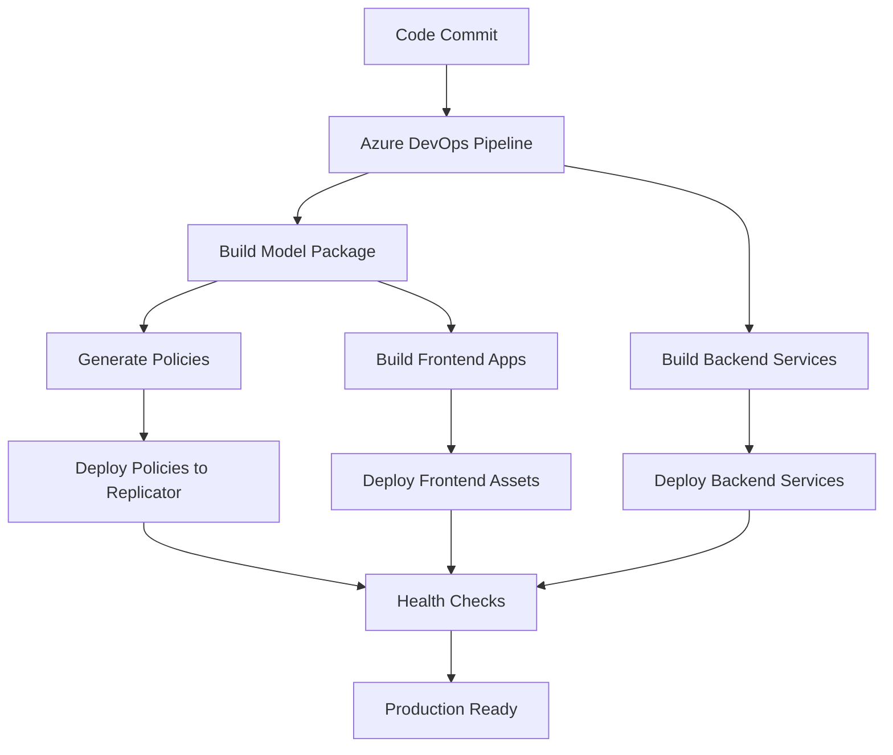

# Deployment

This guide covers the comprehensive deployment setup, CI/CD pipelines, and production configuration for the GameHub platform using Azure DevOps and automated policy generation.

## Table of Contents

- [Deployment Overview](#deployment-overview)
- [Azure DevOps Pipeline Configuration](#azure-devops-pipeline-configuration)
- [Automated Security Policy Generation](#automated-security-policy-generation)
- [Model Package Build Process](#model-package-build-process)
- [Frontend Application Deployment](#frontend-application-deployment)
- [Policy Deployment to Replicator](#policy-deployment-to-replicator)
- [Environment Management](#environment-management)
- [Monitoring and Validation](#monitoring-and-validation)
- [Security and Compliance](#security-and-compliance)
- [Troubleshooting](#troubleshooting)

## Deployment Overview

### Architecture Components

The GameHub deployment architecture consists of:

- **Azure DevOps Pipelines**: Automated CI/CD with multi-stage deployment
- **Jinaga Model Package**: Dual-target builds (ESM + CommonJS) with policy generation
- **React Applications**: Admin and Player frontends with environment injection
- **Backend Services**: Identity providers and content stores
- **Policy System**: Automated security policy generation and deployment

### Deployment Flow



## Azure DevOps Pipeline Configuration

### Current Pipeline Structure

The main pipeline (`.azure-pipelines.yml`) implements a streamlined build and artifact generation process:

```yaml
trigger:
  branches:
    include:
      - main

pool:
  vmImage: 'ubuntu-latest'

variables:
  - group: GameHubEnvironment
  - name: buildAdmin
    value: 'app/gamehub-admin'
  - name: buildPlayer
    value: 'app/gamehub-player'
  - name: buildModel
    value: 'app/gamehub-model'
  - name: outputDir
    value: 'artifacts'
```

### Build Pipeline Steps

#### 1. Environment Setup
```yaml
steps:
- task: NodeTool@0
  inputs:
    versionSpec: '20.x'
  displayName: 'Install Node.js'
```

#### 2. Environment Variable Injection
```yaml
# Create production environment files
- script: |
    echo "Creating .env.production.local for admin application..."
    echo "VITE_CLIENT_ID=$(VITE_CLIENT_ID)" > $(buildAdmin)/.env.production.local
    echo "VITE_TENANT_PUBLIC_KEY=$(VITE_TENANT_PUBLIC_KEY)" >> $(buildAdmin)/.env.production.local
  displayName: 'Create admin .env.production.local'

- script: |
    echo "Creating .env.production.local for player application..."
    echo "VITE_CLIENT_ID=$(VITE_CLIENT_ID)" > $(buildPlayer)/.env.production.local
    echo "VITE_TENANT_PUBLIC_KEY=$(VITE_TENANT_PUBLIC_KEY)" >> $(buildPlayer)/.env.production.local
  displayName: 'Create player .env.production.local'
```

#### 3. Model Package Build and Policy Generation
```yaml
- script: |
    cd $(buildModel)
    npm ci
    npm run build
  displayName: 'Build gamehub-model'
```

#### 4. Frontend Application Builds
```yaml
- script: |
    cd $(buildAdmin)
    npm ci
    npm run build
  displayName: 'Build gamehub-admin'

- script: |
    cd $(buildPlayer)
    npm ci
    npm run build
  displayName: 'Build gamehub-player'
```

#### 5. Artifact Collection
```yaml
- task: CopyFiles@2
  inputs:
    contents: |
      $(buildAdmin)/dist/**
      $(buildPlayer)/dist/**
      mesh/front-end/policies/gamehub.policy
      scripts/deploy.sh
    targetFolder: '$(Build.ArtifactStagingDirectory)'
  displayName: 'Collect built assets and policy'

- task: PublishBuildArtifacts@1
  inputs:
    pathToPublish: '$(Build.ArtifactStagingDirectory)'
    artifactName: 'gamehub-assets'
  displayName: 'Publish build artifacts'
```

### Enhanced Multi-Stage Pipeline

For production deployments, implement this enhanced pipeline structure:

```yaml
# .azure-pipelines-enhanced.yml
trigger:
  branches:
    include:
      - main
      - develop
  paths:
    include:
      - app/*
      - mesh/*
      - .azure-pipelines.yml

variables:
  - group: GameHubEnvironment
  - name: containerRegistry
    value: 'gamehubacr.azurecr.io'
  - name: tag
    value: '$(Build.BuildId)'

stages:
  # Build Stage
  - stage: Build
    displayName: 'Build and Test'
    jobs:
      - job: BuildModel
        displayName: 'Build Model Package'
        steps:
          - task: NodeTool@0
            inputs:
              versionSpec: '20.x'
            displayName: 'Install Node.js'

          - script: |
              cd app/gamehub-model
              npm ci
              npm run build
              npm run generate-policies
            displayName: 'Build model and generate policies'

          - task: PublishPipelineArtifact@1
            inputs:
              targetPath: 'mesh/front-end/policies/gamehub.policy'
              artifact: 'policies'
            displayName: 'Publish generated policies'

      - job: BuildFrontend
        displayName: 'Build Frontend Applications'
        dependsOn: BuildModel
        steps:
          - task: DownloadPipelineArtifact@2
            inputs:
              artifactName: 'policies'
              targetPath: 'mesh/front-end/policies/'

          - script: |
              # Create environment files
              echo "VITE_CLIENT_ID=$(VITE_CLIENT_ID)" > app/gamehub-admin/.env.production.local
              echo "VITE_TENANT_PUBLIC_KEY=$(VITE_TENANT_PUBLIC_KEY)" >> app/gamehub-admin/.env.production.local
              
              echo "VITE_CLIENT_ID=$(VITE_CLIENT_ID)" > app/gamehub-player/.env.production.local
              echo "VITE_TENANT_PUBLIC_KEY=$(VITE_TENANT_PUBLIC_KEY)" >> app/gamehub-player/.env.production.local
            displayName: 'Create environment files'

          - script: |
              cd app/gamehub-admin
              npm ci
              npm run build
            displayName: 'Build admin application'

          - script: |
              cd app/gamehub-player
              npm ci
              npm run build
            displayName: 'Build player application'

          - task: PublishPipelineArtifact@1
            inputs:
              targetPath: 'app/gamehub-admin/dist'
              artifact: 'admin-dist'

          - task: PublishPipelineArtifact@1
            inputs:
              targetPath: 'app/gamehub-player/dist'
              artifact: 'player-dist'

      - job: SecurityScan
        displayName: 'Security and Quality Checks'
        steps:
          - task: NodeTool@0
            inputs:
              versionSpec: '20.x'

          - script: |
              npm audit --audit-level high
            displayName: 'Security audit'
            continueOnError: true

          - task: SonarCloudPrepare@1
            inputs:
              SonarCloud: 'SonarCloud'
              organization: 'codelaunch'
              scannerMode: 'CLI'

          - task: SonarCloudAnalyze@1

          - task: SonarCloudPublish@1
            inputs:
              pollingTimeoutSec: '300'

  # Deploy to Staging
  - stage: DeployStaging
    displayName: 'Deploy to Staging'
    dependsOn: Build
    condition: and(succeeded(), eq(variables['Build.SourceBranch'], 'refs/heads/develop'))
    jobs:
      - deployment: DeployToStaging
        displayName: 'Deploy to Staging Environment'
        environment: 'staging'
        strategy:
          runOnce:
            deploy:
              steps:
                - task: DownloadPipelineArtifact@2
                  inputs:
                    artifactName: 'policies'
                    targetPath: '$(Pipeline.Workspace)/policies'

                - task: DownloadPipelineArtifact@2
                  inputs:
                    artifactName: 'admin-dist'
                    targetPath: '$(Pipeline.Workspace)/admin-dist'

                - task: DownloadPipelineArtifact@2
                  inputs:
                    artifactName: 'player-dist'
                    targetPath: '$(Pipeline.Workspace)/player-dist'

                - task: AzureFileCopy@4
                  inputs:
                    SourcePath: '$(Pipeline.Workspace)/policies/*'
                    azureSubscription: '$(azureServiceConnection)'
                    Destination: 'AzureBlob'
                    storage: '$(stagingStorageAccount)'
                    ContainerName: 'policies'

                - task: AzureStaticWebApp@0
                  inputs:
                    app_location: '$(Pipeline.Workspace)/admin-dist'
                    azure_static_web_apps_api_token: '$(stagingAdminToken)'

                - task: AzureStaticWebApp@0
                  inputs:
                    app_location: '$(Pipeline.Workspace)/player-dist'
                    azure_static_web_apps_api_token: '$(stagingPlayerToken)'

  # Deploy to Production
  - stage: DeployProduction
    displayName: 'Deploy to Production'
    dependsOn: Build
    condition: and(succeeded(), eq(variables['Build.SourceBranch'], 'refs/heads/main'))
    jobs:
      - deployment: DeployToProduction
        displayName: 'Deploy to Production Environment'
        environment: 'production'
        strategy:
          runOnce:
            deploy:
              steps:
                - template: templates/deploy-production.yml
                  parameters:
                    environment: 'production'
                    storageAccount: '$(prodStorageAccount)'
                    adminToken: '$(prodAdminToken)'
                    playerToken: '$(prodPlayerToken)'
```

## Automated Security Policy Generation

### Policy Generation Workflow

The Jinaga model automatically generates security policies during the build process:

#### 1. Model Package Configuration

The model package (`app/gamehub-model/package.json`) includes policy generation:

```json
{
  "scripts": {
    "generate-policies": "npm run build:cjs && node --enable-source-maps ./dist/cjs --generate-policies > ../../mesh/front-end/policies/gamehub.policy"
  }
}
```

#### 2. Generated Policy Structure

The generated policy file (`mesh/front-end/policies/gamehub.policy`) contains authorization rules:

```
authorization {
    any Jinaga.User
    (p1: GameHub.Tenant) {
        u1: Jinaga.User [
            u1 = p1->creator: Jinaga.User
        ]
    } => u1
    (p1: GameHub.Tenant.Administrator) {
        u1: Jinaga.User [
            u1 = p1->tenant: GameHub.Tenant->creator: Jinaga.User
        ]
    } => u1
    // ... additional authorization rules
}
```

#### 3. Policy Integration in CI/CD

```yaml
# Policy generation step in pipeline
- script: |
    cd app/gamehub-model
    npm run generate-policies
  displayName: 'Generate security policies'

# Policy validation
- script: |
    if [ ! -f "mesh/front-end/policies/gamehub.policy" ]; then
      echo "Policy file not generated!"
      exit 1
    fi
    echo "Policy file generated successfully"
  displayName: 'Validate policy generation'
```

#### 4. Policy Versioning

Implement policy versioning for change management:

```bash
#!/bin/bash
# scripts/version-policies.sh

POLICY_FILE="mesh/front-end/policies/gamehub.policy"
VERSION=$(date +%Y%m%d-%H%M%S)
VERSIONED_FILE="mesh/front-end/policies/gamehub-${VERSION}.policy"

# Create versioned copy
cp "$POLICY_FILE" "$VERSIONED_FILE"

# Update policy with version header
echo "# Generated on $(date)" > temp_policy
echo "# Version: $VERSION" >> temp_policy
echo "# Build: $BUILD_BUILDNUMBER" >> temp_policy
echo "" >> temp_policy
cat "$POLICY_FILE" >> temp_policy
mv temp_policy "$POLICY_FILE"

echo "Policy versioned as $VERSION"
```

## Model Package Build Process

### Dual Build Configuration

The model package supports both ESM and CommonJS formats:

#### TypeScript Configurations

**Base Configuration (`tsconfig.base.json`):**
```json
{
  "compilerOptions": {
    "target": "ES2022",
    "lib": ["ES2022"],
    "moduleResolution": "NodeNext",
    "declaration": true,
    "strict": true,
    "esModuleInterop": true,
    "skipLibCheck": true,
    "forceConsistentCasingInFileNames": true,
    "sourceMap": true
  },
  "include": [
    "**/*.ts"
  ],
  "exclude": [
    "node_modules",
    "dist",
    "test"
  ]
}
```

**ESM Configuration (`tsconfig.esm.json`):**
```json
{
  "extends": "./tsconfig.base.json",
  "compilerOptions": {
    "module": "NodeNext",
    "outDir": "./dist/esm",
    "rootDir": "."
  }
}
```

**CommonJS Configuration (`tsconfig.cjs.json`):**
```json
{
  "extends": "./tsconfig.base.json",
  "compilerOptions": {
    "module": "CommonJS",
    "outDir": "./dist/cjs",
    "rootDir": "."
  }
}
```

**Types Configuration (`tsconfig.types.json`):**
```json
{
  "extends": "./tsconfig.base.json",
  "compilerOptions": {
    "declaration": true,
    "emitDeclarationOnly": true,
    "outDir": "./dist/types",
    "rootDir": "."
  }
}
```

#### Package.json Export Configuration

```json
{
  "main": "./dist/cjs/index.js",
  "module": "./dist/esm/index.js",
  "types": "./dist/types/index.d.ts",
  "exports": {
    ".": {
      "import": {
        "types": "./dist/types/index.d.ts",
        "default": "./dist/esm/index.js"
      },
      "require": {
        "types": "./dist/types/index.d.ts",
        "default": "./dist/cjs/index.js"
      }
    },
    "./authorization": {
      "import": {
        "types": "./dist/types/authorization/index.d.ts",
        "default": "./dist/esm/authorization/index.js"
      },
      "require": {
        "types": "./dist/types/authorization/index.d.ts",
        "default": "./dist/cjs/authorization/index.js"
      }
    }
  }
}
```

#### Build Process Integration

```yaml
# Model build in CI/CD
- script: |
    cd app/gamehub-model
    npm ci
    npm run clean
    npm run build:esm
    npm run build:cjs
    npm run build:types
    npm run generate-policies
  displayName: 'Build model package with dual targets'

# Validate build outputs
- script: |
    cd app/gamehub-model
    ls -la dist/esm/
    ls -la dist/cjs/
    ls -la dist/types/
    echo "All build targets completed successfully"
  displayName: 'Validate model build outputs'
```

## Frontend Application Deployment

### React Application Build Process

#### Environment Configuration Management

**Production Environment (`.env.production`):**
```env
VITE_BASE_NAME=/player/
VITE_REPLICATOR_URL=https://gamehub.codelaunch.com/replicator/jinaga
VITE_PLAYER_IP_URL=https://gamehub.codelaunch.com/player-ip
VITE_AUTHORIZATION_ENDPOINT=https://gamehub.codelaunch.com/player-ip/authenticate
VITE_TOKEN_ENDPOINT=https://gamehub.codelaunch.com/player-ip/token
VITE_REDIRECT_URI=https://gamehub.codelaunch.com/player/callback
VITE_LOGOUT_ENDPOINT=https://gamehub.codelaunch.com/player-ip/logout
VITE_CONTENT_STORE_URL=https://gamehub.codelaunch.com/content
VITE_CLIENT_ID=gamehub-player
```

**Dynamic Environment Injection:**
```yaml
# Environment variable injection in pipeline
- script: |
    # Admin application
    cat > app/gamehub-admin/.env.production.local << EOF
    VITE_CLIENT_ID=$(VITE_CLIENT_ID)
    VITE_TENANT_PUBLIC_KEY=$(VITE_TENANT_PUBLIC_KEY)
    VITE_REPLICATOR_URL=$(VITE_REPLICATOR_URL)
    VITE_SERVICE_IP_URL=$(VITE_SERVICE_IP_URL)
    EOF
    
    # Player application
    cat > app/gamehub-player/.env.production.local << EOF
    VITE_CLIENT_ID=$(VITE_CLIENT_ID)
    VITE_TENANT_PUBLIC_KEY=$(VITE_TENANT_PUBLIC_KEY)
    VITE_REPLICATOR_URL=$(VITE_REPLICATOR_URL)
    VITE_PLAYER_IP_URL=$(VITE_PLAYER_IP_URL)
    EOF
  displayName: 'Create environment configuration files'
```

#### Build Optimization

**Vite Configuration for Production:**
```typescript
// vite.config.ts
import { defineConfig } from 'vite'
import react from '@vitejs/plugin-react-swc'

export default defineConfig({
  plugins: [react()],
  build: {
    outDir: 'dist',
    sourcemap: true,
    rollupOptions: {
      output: {
        manualChunks: {
          vendor: ['react', 'react-dom'],
          jinaga: ['jinaga', 'jinaga-react'],
          router: ['react-router-dom']
        }
      }
    },
    chunkSizeWarningLimit: 1000
  },
  define: {
    'process.env.NODE_ENV': JSON.stringify('production')
  }
})
```

#### Container Build Process

**Player Application Container Build:**
```json
{
  "scripts": {
    "build:container": "vite build --mode container && mkdir -p ../../mesh/nginx/app/gamehub-player && cp -r dist/* ../../mesh/nginx/app/gamehub-player"
  }
}
```

#### Asset Optimization Pipeline

```yaml
# Frontend build with optimization
- script: |
    cd app/gamehub-player
    npm ci
    npm run build
    
    # Optimize assets
    npx imagemin dist/assets/*.{jpg,png,svg} --out-dir=dist/assets/optimized
    
    # Generate asset manifest
    find dist -name "*.js" -o -name "*.css" | jq -R -s 'split("\n")[:-1]' > dist/asset-manifest.json
  displayName: 'Build and optimize player application'

# Validate build output
- script: |
    cd app/gamehub-player
    if [ ! -d "dist" ]; then
      echo "Build failed - dist directory not found"
      exit 1
    fi
    
    # Check for required files
    required_files=("index.html" "assets")
    for file in "${required_files[@]}"; do
      if [ ! -e "dist/$file" ]; then
        echo "Required file/directory missing: $file"
        exit 1
      fi
    done
    
    echo "Build validation successful"
  displayName: 'Validate frontend build'
```

## Policy Deployment to Replicator

### Automated Policy Deployment

#### Policy Validation Pipeline

```yaml
# Policy validation and deployment
- script: |
    POLICY_FILE="mesh/front-end/policies/gamehub.policy"
    
    # Validate policy syntax
    if ! grep -q "authorization {" "$POLICY_FILE"; then
      echo "Invalid policy format"
      exit 1
    fi
    
    # Check policy size
    POLICY_SIZE=$(wc -c < "$POLICY_FILE")
    if [ "$POLICY_SIZE" -lt 100 ]; then
      echo "Policy file too small, likely incomplete"
      exit 1
    fi
    
    echo "Policy validation successful"
  displayName: 'Validate generated policies'
```

#### Replicator Deployment

```yaml
# Deploy policies to Jinaga replicator
- task: AzureFileCopy@4
  inputs:
    SourcePath: 'mesh/front-end/policies/gamehub.policy'
    azureSubscription: '$(azureServiceConnection)'
    Destination: 'AzureBlob'
    storage: '$(policyStorageAccount)'
    ContainerName: 'policies'
    BlobPrefix: 'current/'
  displayName: 'Deploy policies to storage'

# Update replicator configuration
- task: AzureAppServiceManage@0
  inputs:
    azureSubscription: '$(azureServiceConnection)'
    Action: 'Restart Azure App Service'
    WebAppName: '$(replicatorAppService)'
  displayName: 'Restart replicator to load new policies'
```

#### Policy Rollback Mechanism

```bash
#!/bin/bash
# scripts/rollback-policies.sh

STORAGE_ACCOUNT="$1"
CONTAINER_NAME="policies"
BACKUP_VERSION="$2"

if [ -z "$BACKUP_VERSION" ]; then
  echo "Usage: $0 <storage-account> <backup-version>"
  exit 1
fi

# Copy backup policy to current
az storage blob copy start \
  --account-name "$STORAGE_ACCOUNT" \
  --destination-container "$CONTAINER_NAME" \
  --destination-blob "current/gamehub.policy" \
  --source-container "$CONTAINER_NAME" \
  --source-blob "backups/gamehub-${BACKUP_VERSION}.policy"

echo "Policy rolled back to version $BACKUP_VERSION"

# Restart replicator
az webapp restart --name "$REPLICATOR_APP_SERVICE" --resource-group "$RESOURCE_GROUP"
```

#### Health Checks for Policy Deployment

```yaml
# Policy deployment health checks
- script: |
    REPLICATOR_URL="$(VITE_REPLICATOR_URL)"
    
    # Wait for replicator to restart
    sleep 30
    
    # Check replicator health
    for i in {1..10}; do
      if curl -f "$REPLICATOR_URL/health"; then
        echo "Replicator health check passed"
        break
      fi
      echo "Health check attempt $i failed, retrying..."
      sleep 10
    done
    
    # Validate policy is loaded
    if curl -f "$REPLICATOR_URL/policies/validate"; then
      echo "Policy validation successful"
    else
      echo "Policy validation failed"
      exit 1
    fi
  displayName: 'Validate policy deployment'
```

## Environment Management

### Environment-Specific Configuration

#### Development Environment
```yaml
# Development environment variables
variables:
  - name: environment
    value: 'development'
  - name: VITE_REPLICATOR_URL
    value: 'http://localhost:8080/jinaga'
  - name: VITE_PLAYER_SERVICE_URL
    value: 'http://localhost:3001'
  - name: VITE_GAME_SERVICE_URL
    value: 'http://localhost:3002'
```

#### Staging Environment
```yaml
# Staging environment variables
variables:
  - group: GameHub-Staging
  - name: environment
    value: 'staging'
  - name: VITE_REPLICATOR_URL
    value: 'https://staging.gamehub.com/replicator/jinaga'
  - name: VITE_PLAYER_SERVICE_URL
    value: 'https://staging.gamehub.com/player-service'
```

#### Production Environment
```yaml
# Production environment variables
variables:
  - group: GameHub-Production
  - name: environment
    value: 'production'
  - name: VITE_REPLICATOR_URL
    value: 'https://gamehub.com/replicator/jinaga'
  - name: VITE_PLAYER_SERVICE_URL
    value: 'https://gamehub.com/player-service'
```

### Secret Management

#### Azure Key Vault Integration

```yaml
# Key Vault integration
- task: AzureKeyVault@2
  inputs:
    azureSubscription: '$(azureServiceConnection)'
    KeyVaultName: '$(keyVaultName)'
    SecretsFilter: 'VITE-CLIENT-ID,VITE-TENANT-PUBLIC-KEY,DATABASE-PASSWORD'
    RunAsPreJob: true
  displayName: 'Fetch secrets from Key Vault'

# Use secrets in environment files
- script: |
    echo "VITE_CLIENT_ID=$(VITE-CLIENT-ID)" > .env.production.local
    echo "VITE_TENANT_PUBLIC_KEY=$(VITE-TENANT-PUBLIC-KEY)" >> .env.production.local
    echo "DATABASE_PASSWORD=$(DATABASE-PASSWORD)" >> .env.production.local
  displayName: 'Create secure environment file'
```

#### Environment Validation

```bash
#!/bin/bash
# scripts/validate-environment.sh

ENVIRONMENT="$1"
REQUIRED_VARS=("VITE_CLIENT_ID" "VITE_TENANT_PUBLIC_KEY" "VITE_REPLICATOR_URL")

echo "Validating $ENVIRONMENT environment..."

for var in "${REQUIRED_VARS[@]}"; do
  if [ -z "${!var}" ]; then
    echo "ERROR: Required environment variable $var is not set"
    exit 1
  fi
  echo "✓ $var is set"
done

# Validate URLs are accessible
if ! curl -f "$VITE_REPLICATOR_URL/health" > /dev/null 2>&1; then
  echo "WARNING: Replicator URL is not accessible"
fi

echo "Environment validation completed"
```

## Monitoring and Validation

### Deployment Health Checks

#### Application Health Monitoring

```yaml
# Health check pipeline
- script: |
    APPS=("admin" "player")
    BASE_URL="https://gamehub.com"
    
    for app in "${APPS[@]}"; do
      echo "Checking $app application..."
      
      # Check if app loads
      if curl -f "$BASE_URL/$app/" > /dev/null 2>&1; then
        echo "✓ $app application is accessible"
      else
        echo "✗ $app application is not accessible"
        exit 1
      fi
      
      # Check for JavaScript errors
      if curl -s "$BASE_URL/$app/" | grep -q "error\|Error"; then
        echo "⚠ Potential JavaScript errors detected in $app"
      fi
    done
  displayName: 'Application health checks'
```

#### Performance Monitoring

```yaml
# Performance validation
- script: |
    npm install -g lighthouse
    
    # Run Lighthouse audits
    lighthouse https://gamehub.com/admin/ \
      --output json \
      --output-path admin-lighthouse.json \
      --chrome-flags="--headless --no-sandbox"
    
    lighthouse https://gamehub.com/player/ \
      --output json \
      --output-path player-lighthouse.json \
      --chrome-flags="--headless --no-sandbox"
    
    # Check performance scores
    ADMIN_SCORE=$(jq '.categories.performance.score * 100' admin-lighthouse.json)
    PLAYER_SCORE=$(jq '.categories.performance.score * 100' player-lighthouse.json)
    
    echo "Admin performance score: $ADMIN_SCORE"
    echo "Player performance score: $PLAYER_SCORE"
    
    if (( $(echo "$ADMIN_SCORE < 80" | bc -l) )); then
      echo "WARNING: Admin performance score below threshold"
    fi
    
    if (( $(echo "$PLAYER_SCORE < 80" | bc -l) )); then
      echo "WARNING: Player performance score below threshold"
    fi
  displayName: 'Performance monitoring'
```

#### Automated Testing in Deployment

```yaml
# End-to-end testing
- script: |
    cd app/gamehub-player
    npm run test:e2e:prod
  displayName: 'Run E2E tests against production'
  condition: eq(variables['environment'], 'production')

# API health checks
- script: |
    ENDPOINTS=(
      "$(VITE_REPLICATOR_URL)/health"
      "$(VITE_PLAYER_SERVICE_URL)/health"
      "$(VITE_GAME_SERVICE_URL)/health"
    )
    
    for endpoint in "${ENDPOINTS[@]}"; do
      echo "Testing $endpoint..."
      if curl -f "$endpoint"; then
        echo "✓ $endpoint is healthy"
      else
        echo "✗ $endpoint is not responding"
        exit 1
      fi
    done
  displayName: 'API health validation'
```

### Rollback Procedures

#### Automated Rollback

```yaml
# Rollback pipeline
- script: |
    PREVIOUS_BUILD=$(az pipelines build list \
      --organization "$(System.TeamFoundationCollectionUri)" \
      --project "$(System.TeamProject)" \
      --definition-ids "$(System.DefinitionId)" \
      --status completed \
      --result succeeded \
      --top 2 \
      --query "[1].buildNumber" \
      --output tsv)
    
    echo "Rolling back to build: $PREVIOUS_BUILD"
    
    # Download previous artifacts
    az pipelines runs artifact download \
      --organization "$(System.TeamFoundationCollectionUri)" \
      --project "$(System.TeamProject)" \
      --run-id "$PREVIOUS_BUILD" \
      --artifact-name "gamehub-assets" \
      --path "$(Pipeline.
Workspace)" \
      --path "$(Pipeline.Workspace)/rollback"
    
    # Deploy previous version
    az storage blob upload-batch \
      --account-name "$(storageAccount)" \
      --destination '$web' \
      --source "$(Pipeline.Workspace)/rollback" \
      --overwrite
    
    echo "Rollback completed to build $PREVIOUS_BUILD"
  displayName: 'Automated rollback'
  condition: failed()
```

#### Manual Rollback Script

```bash
#!/bin/bash
# scripts/manual-rollback.sh

ENVIRONMENT="$1"
TARGET_BUILD="$2"

if [ -z "$ENVIRONMENT" ] || [ -z "$TARGET_BUILD" ]; then
  echo "Usage: $0 <environment> <target-build-number>"
  echo "Example: $0 production 12345"
  exit 1
fi

echo "Rolling back $ENVIRONMENT to build $TARGET_BUILD..."

# Backup current deployment
BACKUP_DIR="backups/$(date +%Y%m%d-%H%M%S)"
mkdir -p "$BACKUP_DIR"

# Download target build artifacts
az pipelines runs artifact download \
  --organization "$AZURE_DEVOPS_ORG" \
  --project "$AZURE_DEVOPS_PROJECT" \
  --run-id "$TARGET_BUILD" \
  --artifact-name "gamehub-assets" \
  --path "$BACKUP_DIR"

# Deploy to target environment
case $ENVIRONMENT in
  "staging")
    STORAGE_ACCOUNT="$STAGING_STORAGE_ACCOUNT"
    ;;
  "production")
    STORAGE_ACCOUNT="$PROD_STORAGE_ACCOUNT"
    ;;
  *)
    echo "Unknown environment: $ENVIRONMENT"
    exit 1
    ;;
esac

# Upload artifacts
az storage blob upload-batch \
  --account-name "$STORAGE_ACCOUNT" \
  --destination '$web' \
  --source "$BACKUP_DIR" \
  --overwrite

echo "Rollback completed successfully"
```

## Security and Compliance

### Security Scanning Pipeline

#### Dependency Vulnerability Scanning

```yaml
# Security scanning stage
- stage: SecurityScan
  displayName: 'Security and Compliance'
  jobs:
    - job: VulnerabilityScan
      displayName: 'Dependency Vulnerability Scan'
      steps:
        - task: NodeTool@0
          inputs:
            versionSpec: '20.x'

        # Audit npm dependencies
        - script: |
            cd app/gamehub-model
            npm audit --audit-level high --json > model-audit.json || true
            
            cd ../gamehub-admin
            npm audit --audit-level high --json > admin-audit.json || true
            
            cd ../gamehub-player
            npm audit --audit-level high --json > player-audit.json || true
          displayName: 'Run npm audit'

        # Process audit results
        - script: |
            HIGH_VULNS=$(jq '.metadata.vulnerabilities.high // 0' app/*/audit.json | paste -sd+ | bc)
            CRITICAL_VULNS=$(jq '.metadata.vulnerabilities.critical // 0' app/*/audit.json | paste -sd+ | bc)
            
            echo "High vulnerabilities: $HIGH_VULNS"
            echo "Critical vulnerabilities: $CRITICAL_VULNS"
            
            if [ "$CRITICAL_VULNS" -gt 0 ]; then
              echo "CRITICAL vulnerabilities found - blocking deployment"
              exit 1
            fi
            
            if [ "$HIGH_VULNS" -gt 5 ]; then
              echo "Too many HIGH vulnerabilities - review required"
              exit 1
            fi
          displayName: 'Evaluate security scan results'

        # Snyk security scanning
        - task: SnykSecurityScan@1
          inputs:
            serviceConnectionEndpoint: 'Snyk'
            testType: 'app'
            severityThreshold: 'high'
            monitorWhen: 'always'
            failOnIssues: true
```

#### Code Quality Gates

```yaml
# Code quality validation
- job: CodeQuality
  displayName: 'Code Quality Assessment'
  steps:
    - task: SonarCloudPrepare@1
      inputs:
        SonarCloud: 'SonarCloud'
        organization: 'gamehub'
        scannerMode: 'CLI'
        configMode: 'manual'
        cliProjectKey: 'gamehub_platform'
        cliProjectName: 'GameHub'
        cliSources: 'app'
        extraProperties: |
          sonar.javascript.lcov.reportPaths=app/*/coverage/lcov.info
          sonar.typescript.lcov.reportPaths=app/*/coverage/lcov.info
          sonar.exclusions=**/node_modules/**,**/dist/**

    - script: |
        cd app/gamehub-model
        npm run test:coverage
        
        cd ../gamehub-admin
        npm run test:coverage
        
        cd ../gamehub-player
        npm run test:coverage
      displayName: 'Run tests with coverage'

    - task: SonarCloudAnalyze@1

    - task: SonarCloudPublish@1
      inputs:
        pollingTimeoutSec: '300'

    # Quality gate check
    - script: |
        QUALITY_GATE=$(curl -s -u "$(SONAR_TOKEN):" \
          "https://sonarcloud.io/api/qualitygates/project_status?projectKey=gamehub_platform" \
          | jq -r '.projectStatus.status')
        
        if [ "$QUALITY_GATE" != "OK" ]; then
          echo "Quality gate failed: $QUALITY_GATE"
          exit 1
        fi
        
        echo "Quality gate passed"
      displayName: 'Check quality gate'
```

#### Compliance Validation

```yaml
# Compliance checks
- job: ComplianceCheck
  displayName: 'Compliance Validation'
  steps:
    # License compliance
    - script: |
        npm install -g license-checker
        
        cd app/gamehub-model
        license-checker --onlyAllow 'MIT;Apache-2.0;BSD-2-Clause;BSD-3-Clause;ISC' --json > model-licenses.json
        
        cd ../gamehub-admin
        license-checker --onlyAllow 'MIT;Apache-2.0;BSD-2-Clause;BSD-3-Clause;ISC' --json > admin-licenses.json
        
        cd ../gamehub-player
        license-checker --onlyAllow 'MIT;Apache-2.0;BSD-2-Clause;BSD-3-Clause;ISC' --json > player-licenses.json
      displayName: 'License compliance check'

    # GDPR compliance validation
    - script: |
        # Check for potential PII in code
        grep -r "email\|phone\|ssn\|social" app/ --include="*.ts" --include="*.tsx" || true
        
        # Validate privacy policy references
        if ! grep -r "privacy" app/*/src/ --include="*.tsx"; then
          echo "WARNING: No privacy policy references found"
        fi
      displayName: 'GDPR compliance check'

    # Security headers validation
    - script: |
        # Check for security headers in nginx config
        if [ -f "mesh/nginx/nginx.conf" ]; then
          REQUIRED_HEADERS=("X-Frame-Options" "X-Content-Type-Options" "X-XSS-Protection")
          
          for header in "${REQUIRED_HEADERS[@]}"; do
            if ! grep -q "$header" mesh/nginx/nginx.conf; then
              echo "WARNING: Missing security header: $header"
            fi
          done
        fi
      displayName: 'Security headers validation'
```

### Audit Logging

#### Deployment Audit Trail

```yaml
# Audit logging
- script: |
    AUDIT_LOG="deployment-audit-$(date +%Y%m%d-%H%M%S).json"
    
    cat > "$AUDIT_LOG" << EOF
    {
      "timestamp": "$(date -u +%Y-%m-%dT%H:%M:%SZ)",
      "buildId": "$(Build.BuildId)",
      "buildNumber": "$(Build.BuildNumber)",
      "sourceVersion": "$(Build.SourceVersion)",
      "sourceBranch": "$(Build.SourceBranch)",
      "requestedBy": "$(Build.RequestedFor)",
      "environment": "$(environment)",
      "artifacts": [
        "admin-dist",
        "player-dist",
        "policies"
      ],
      "deploymentStatus": "initiated"
    }
    EOF
    
    # Upload audit log
    az storage blob upload \
      --account-name "$(auditStorageAccount)" \
      --container-name "audit-logs" \
      --name "$AUDIT_LOG" \
      --file "$AUDIT_LOG"
  displayName: 'Create deployment audit log'
```

## Troubleshooting

### Common Deployment Issues

#### Policy Generation Failures

**Issue**: Policy file not generated or empty
```bash
# Diagnosis
cd app/gamehub-model
npm run build:cjs
node --enable-source-maps ./dist/cjs --generate-policies

# Common fixes:
# 1. Check model compilation errors
npm run build:cjs 2>&1 | grep -i error

# 2. Verify authorization rules in model files
grep -r "authorization" authorization/

# 3. Check for missing dependencies
npm ls jinaga
```

**Issue**: Invalid policy syntax
```bash
# Validate policy file
POLICY_FILE="mesh/front-end/policies/gamehub.policy"

# Check basic structure
if ! grep -q "authorization {" "$POLICY_FILE"; then
  echo "Missing authorization block"
fi

# Check for syntax errors
if grep -q "=>" "$POLICY_FILE"; then
  echo "Policy contains authorization rules"
else
  echo "No authorization rules found"
fi
```

#### Build Failures

**Issue**: Frontend build fails with environment variables
```bash
# Check environment file creation
ls -la app/gamehub-*/.env.production.local

# Validate environment variables
cd app/gamehub-player
npm run build 2>&1 | grep -i "VITE_"

# Common fixes:
# 1. Ensure all required VITE_ variables are set
# 2. Check for special characters in environment values
# 3. Verify .env file format
```

**Issue**: Model package build fails
```bash
# Check TypeScript compilation
cd app/gamehub-model
npm run build:esm 2>&1 | tee esm-build.log
npm run build:cjs 2>&1 | tee cjs-build.log

# Check for type errors
grep -i "error TS" *.log

# Verify output directories
ls -la dist/esm/ dist/cjs/ dist/types/
```

#### Deployment Failures

**Issue**: Azure deployment fails
```bash
# Check Azure CLI authentication
az account show

# Verify resource group exists
az group show --name "gamehub-prod-rg"

# Check storage account access
az storage account show --name "gamehubstorage"

# Test file upload
az storage blob upload \
  --account-name "gamehubstorage" \
  --container-name '$web' \
  --name "test.txt" \
  --file "test.txt"
```

### Performance Issues

#### Build Performance Optimization

```yaml
# Optimized build pipeline
- script: |
    # Enable npm cache
    npm config set cache ~/.npm-cache
    
    # Use npm ci for faster installs
    cd app/gamehub-model
    time npm ci
    
    # Parallel builds where possible
    cd ../gamehub-admin
    npm ci &
    
    cd ../gamehub-player
    npm ci &
    
    wait  # Wait for parallel installs
  displayName: 'Optimized dependency installation'

# Build caching
- task: Cache@2
  inputs:
    key: 'npm | "$(Agent.OS)" | app/*/package-lock.json'
    restoreKeys: |
      npm | "$(Agent.OS)"
      npm
    path: ~/.npm-cache
  displayName: 'Cache npm packages'
```

#### Runtime Performance Monitoring

```bash
#!/bin/bash
# scripts/performance-monitor.sh

APPS=("admin" "player")
BASE_URL="https://gamehub.com"

for app in "${APPS[@]}"; do
  echo "Monitoring $app performance..."
  
  # Measure load time
  LOAD_TIME=$(curl -w "%{time_total}" -s -o /dev/null "$BASE_URL/$app/")
  echo "$app load time: ${LOAD_TIME}s"
  
  # Check bundle sizes
  BUNDLE_SIZE=$(curl -s "$BASE_URL/$app/" | grep -o 'assets/[^"]*\.js' | head -1 | xargs -I {} curl -s -I "$BASE_URL/$app/{}" | grep -i content-length | cut -d' ' -f2)
  echo "$app bundle size: $BUNDLE_SIZE bytes"
  
  # Performance thresholds
  if (( $(echo "$LOAD_TIME > 3.0" | bc -l) )); then
    echo "WARNING: $app load time exceeds 3 seconds"
  fi
done
```

### Monitoring and Alerting Setup

#### Application Insights Integration

```yaml
# Application Insights setup
- task: AzureCLI@2
  inputs:
    azureSubscription: '$(azureServiceConnection)'
    scriptType: 'bash'
    scriptLocation: 'inlineScript'
    inlineScript: |
      # Create Application Insights resource
      az monitor app-insights component create \
        --app gamehub-insights \
        --location eastus \
        --resource-group gamehub-prod-rg \
        --application-type web
      
      # Get instrumentation key
      INSTRUMENTATION_KEY=$(az monitor app-insights component show \
        --app gamehub-insights \
        --resource-group gamehub-prod-rg \
        --query instrumentationKey \
        --output tsv)
      
      echo "##vso[task.setvariable variable=INSTRUMENTATION_KEY]$INSTRUMENTATION_KEY"
  displayName: 'Setup Application Insights'
```

#### Health Check Endpoints

```typescript
// Health check implementation
// app/player-service/src/routes/health.ts
import { Router } from 'express';

const router = Router();

router.get('/health', async (req, res) => {
  const health = {
    status: 'healthy',
    timestamp: new Date().toISOString(),
    version: process.env.npm_package_version,
    environment: process.env.NODE_ENV,
    checks: {
      database: await checkDatabase(),
      replicator: await checkReplicator(),
      policies: await checkPolicies()
    }
  };
  
  const isHealthy = Object.values(health.checks).every(check => check.status === 'ok');
  
  res.status(isHealthy ? 200 : 503).json(health);
});

async function checkDatabase() {
  try {
    // Database connectivity check
    return { status: 'ok', responseTime: '< 100ms' };
  } catch (error) {
    return { status: 'error', error: error.message };
  }
}

async function checkReplicator() {
  try {
    // Replicator connectivity check
    return { status: 'ok', responseTime: '< 200ms' };
  } catch (error) {
    return { status: 'error', error: error.message };
  }
}

async function checkPolicies() {
  try {
    // Policy validation check
    return { status: 'ok', lastUpdated: new Date().toISOString() };
  } catch (error) {
    return { status: 'error', error: error.message };
  }
}

export default router;
```

## Next Steps

After completing the deployment setup:

1. **Set up monitoring dashboards** in Azure Application Insights
2. **Configure alerting rules** for critical metrics and failures
3. **Implement automated testing** in the deployment pipeline
4. **Set up disaster recovery** procedures and backup strategies
5. **Document runbook procedures** for common operational tasks
6. **Train team members** on deployment processes and troubleshooting

For additional deployment scenarios and advanced configurations, refer to:
- [Docker Orchestration](./07-docker-orchestration.md) for containerized deployments
- [Authentication](./08-authentication.md) for security configuration
- [Troubleshooting](./10-troubleshooting.md) for operational issues

---

This deployment guide provides a comprehensive foundation for implementing robust CI/CD pipelines with automated policy generation, security scanning, and production-ready deployment strategies for the GameHub platform.