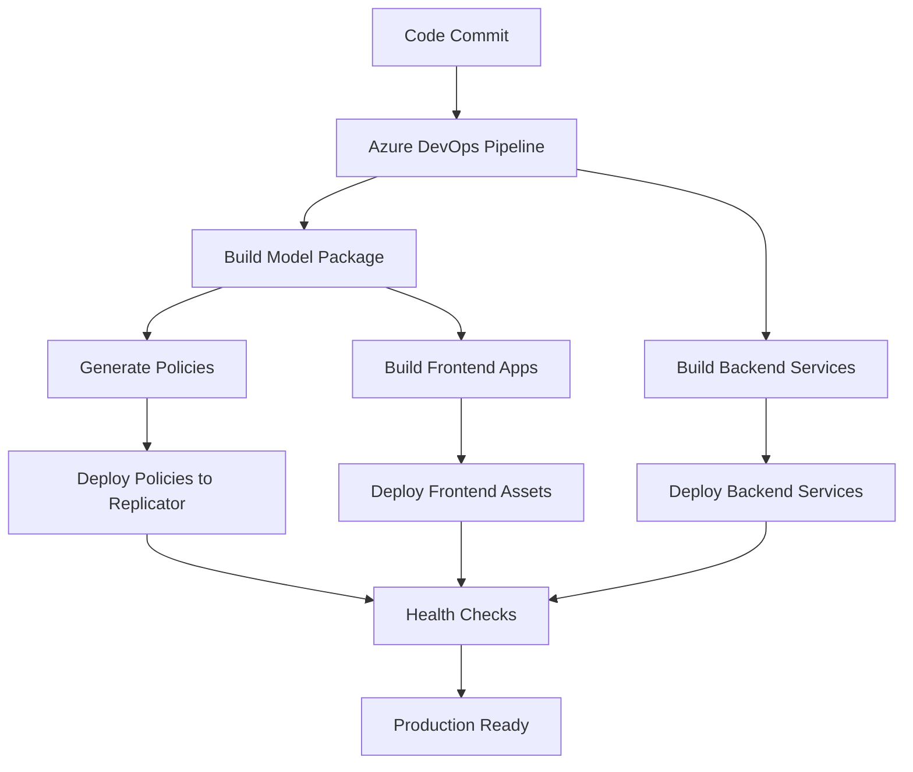

# Deployment

This guide covers the comprehensive deployment setup, CI/CD pipelines, and production configuration for the GameHub platform using Azure DevOps and automated policy generation.

## Table of Contents

- [Deployment](#deployment)
  - [Table of Contents](#table-of-contents)
  - [Deployment Overview](#deployment-overview)
    - [Architecture Components](#architecture-components)
    - [Deployment Flow](#deployment-flow)
  - [Backend Service Deployment](#backend-service-deployment)
    - [Service IP Deployment](#service-ip-deployment)
      - [Build and Deploy](#build-and-deploy)
      - [Production Environment Variables](#production-environment-variables)
      - [Secrets Management](#secrets-management)
      - [Health Checks and Monitoring](#health-checks-and-monitoring)
  - [Frontend Application Deployment](#frontend-application-deployment)
    - [React Application Build Process](#react-application-build-process)
      - [Environment Configuration Management](#environment-configuration-management)
  - [Next Steps](#next-steps)

## Deployment Overview

### Architecture Components

The GameHub deployment architecture consists of:

- **Azure DevOps Pipelines**: Automated CI/CD with multi-stage deployment
- **Jinaga Model Package**: Dual-target builds (ESM + CommonJS) with policy generation
- **React Applications**: Admin and Player frontends with environment injection
- **Backend Services**: Identity providers (service-ip, player-ip) and content stores
- **Policy System**: Automated security policy generation and deployment

### Deployment Flow



## Backend Service Deployment

### Service IP Deployment

Service-ip is deployed as part of the mesh infrastructure using Docker Compose.

#### Build and Deploy

```bash
# Build and deploy service-ip
npm run build:service-ip
./scripts/build-service-ip.sh
./scripts/deploy-mesh.sh
```

#### Production Environment Variables

```env
NODE_ENV=production
PORT=8083
JWT_SECRET=<production-secret>
CLIENTS_DIR=/app/secrets/clients
```

#### Secrets Management

Client credentials are managed in `mesh/secrets/service-ip/clients/`. Each client requires both a JSON configuration file and a plain text secret file.

**Production Client Setup:**
```bash
# Generate production client credentials
CLIENT_SECRET=$(openssl rand -base64 32)
echo "$CLIENT_SECRET" > mesh/secrets/service-ip/clients/prod-client
echo '{"clientId":"prod-client","clientSecret":"'$CLIENT_SECRET'","scopes":["read","write"]}' > mesh/secrets/service-ip/clients/prod-client.json
```

#### Health Checks and Monitoring

- Health endpoint: `GET /health`
- Token endpoint: `POST /oauth/token`

For detailed service configuration and API usage, see [Backend Services - Service IP](./06-backend-services.md#service-identity-provider-service-ip).

## Frontend Application Deployment

### React Application Build Process

#### Environment Configuration Management

**Production Environment (`.env.production`):**
```env
VITE_BASE_NAME=/player/
VITE_REPLICATOR_URL=https://gamehub.qedcode.com/replicator/jinaga
VITE_PLAYER_IP_URL=https://gamehub.qedcode.com/player-ip
VITE_AUTHORIZATION_ENDPOINT=https://gamehub.qedcode.com/player-ip/authenticate
VITE_TOKEN_ENDPOINT=https://gamehub.qedcode.com/player-ip/token
VITE_REDIRECT_URI=https://gamehub.qedcode.com/player/callback
VITE_LOGOUT_ENDPOINT=https://gamehub.qedcode.com/player-ip/logout
VITE_CONTENT_STORE_URL=https://gamehub.qedcode.com/content
VITE_CLIENT_ID=gamehub-player
```

## Next Steps

After completing the deployment setup:

1. **Set up monitoring dashboards** in Azure Application Insights
2. **Configure alerting rules** for critical metrics and failures
3. **Implement automated testing** in the deployment pipeline
4. **Set up disaster recovery** procedures and backup strategies
5. **Document runbook procedures** for common operational tasks
6. **Train team members** on deployment processes and troubleshooting

For additional deployment scenarios and advanced configurations, refer to:
- [Docker Orchestration](./07-docker-orchestration.md) for containerized deployments
- [Authentication](./08-authentication.md) for security configuration
- [Troubleshooting](./10-troubleshooting.md) for operational issues

---

This deployment guide provides a comprehensive foundation for implementing robust CI/CD pipelines with automated policy generation, security scanning, and production-ready deployment strategies for the GameHub platform.